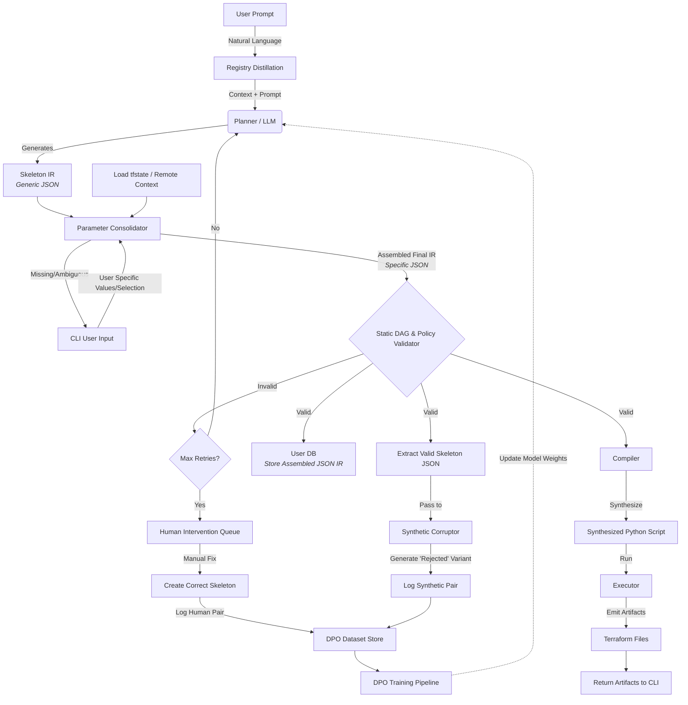

# AGX: From Prompt → JSON Plan → Validated → Terraform HCL

AGX is a verifiable AI workflow engine. You type a natural‑language instruction, AGX generates a strict JSON plan using a registry of approved functions, validates the plan, and compiles the result to Terraform HCL you can inspect locally.

**Live demo:** https://agx.run

## Architecture


## What This Repo Demonstrates

- **Prompt → JSON Plan**: AWS-first demo with structured plan generation
- **Plan Validator**: Ensures only registry functions, correct parameters, and valid variable references
- **Compiler/Runtime**: Turns validated plans into Terraform HCL and writes `main.tf`

## Quickstart

Run the AWS S3 example end‑to‑end locally:

```bash
python -m venv venv
source venv/bin/activate
pip install -r requirements.txt
python agx/registries/devops_test.py
```

This creates a `main.tf` in the repository root containing an `aws_s3_bucket` and an accompanying `aws_s3_bucket_public_access_block`.

## Example

**Prompt:**
```
Create an S3 bucket agx-demo-123 with all public access blocked and save to main.tf.
```

**Expected planner output (JSON array):**
```json
[
  {
    "function": "set_bucket_name",
    "args": { "name": "agx-demo-123" },
    "assign": "bucket_name"
  },
  {
    "function": "create_aws_s3_bucket",
    "args": { "label": "demo_bucket", "bucket_name": "{bucket_name}" },
    "assign": "bucket_hcl"
  },
  {
    "function": "aws_s3_bucket_public_access_block",
    "args": { "label": "demo_bucket", "block_all_public": true },
    "assign": "block_hcl"
  },
  {
    "function": "save_hcl_to_file",
    "args": { "hcl_content": "{bucket_hcl}\n{block_hcl}", "filename": "main.tf" }
  }
]
```

## Safety Features

- **Registry-only execution**: No freeform shell access
- **Strict JSON schema**: Only `function`, `args`, and optional `assign` keys
- **Variable reference validation**: Variables must be previously assigned
- **Type checking**: Arguments validated against function signatures
- **Local file output**: HCL written to `main.tf` for inspection before execution

## Development Status

**Current State:**
- ✅ Basic compiler works
- ✅ Validation works
- ✅ Plan generation and compilation pipeline functional

**Next Steps:**
- Implement "Replanning" (taking existing IR + new prompt → new IR)
- Dependency resolution for the replanner
- State drift handling

**The "Replanning" Logic:**
1. System reads the existing JSON plan (IR)
2. LLM receives:
   - The user's new prompt
   - The current state (the old IR)
3. Output is a new complete IR that replaces the old one
4. **Critical:** The compiler must overwrite `agx_resources.tf` completely

**Outstanding Questions:**
- How do we handle state drift? (For now: assume IR is source of truth)
- Where does `inspect.getsource` need to be updated if we add new registry functions?

## Roadmap

- **Current**: S3 bucket + public access block + save to file
- **Next**: VPC, IAM, RDS primitives
- **Future**: CI/CD flows (GitHub Actions) and Kubernetes

## Frontend

The Next.js app in `agx_frontend/` shows the 3‑step pipeline visually. The copy and examples are AWS‑first in this branch.

---

AGX is built for verifiable DevOps automation. See the live demo at https://agx.run
