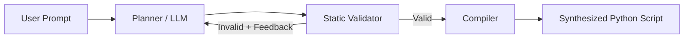
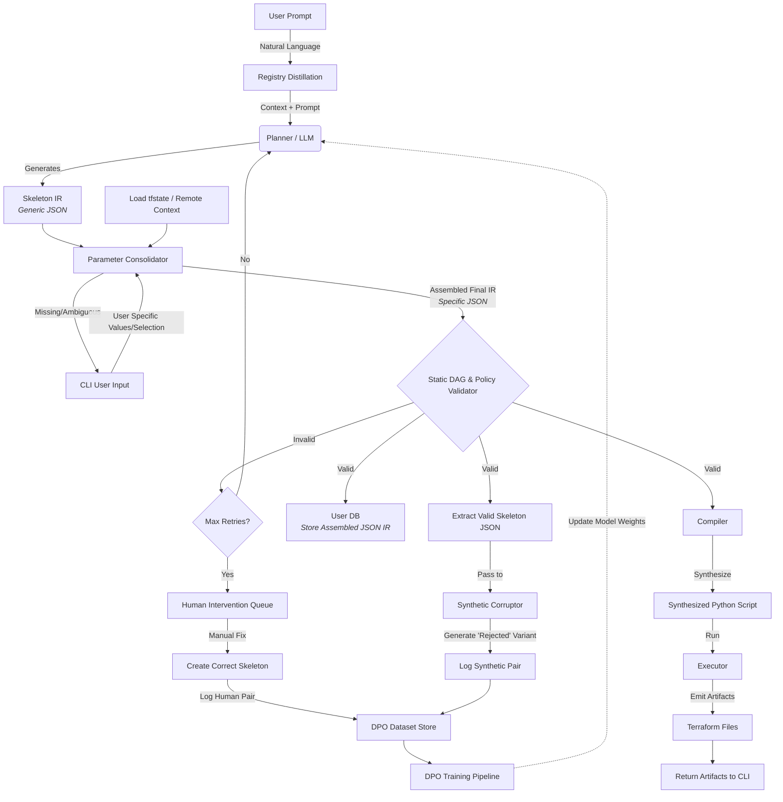

# AGX - A Static Validation Approach to LLM Task Planning
## What this is
AGX is a single-shot agentic Terraform generator that constrains the LLM planner to a predefined function registry, statically validating each generated plan before compilation. Validation checks for function existence, parameter usage, variable assignment order, and type correctness.

This repository contains the core planning, validation, and compilation logic alongside a React frontend and FastAPI backend.

## Motivation
Most agentic LLM pipelines rely on the model to self-correct at runtime. The question this project explored was whether moving validation earlier (before execution) and restricting output to a known function registry could produce more predictable results. Terraform was chosen as the target domain because its declarative nature makes it well suited to template-based generation.

## How it works

## What I found
Constraining output and validating output address different failure modes - constraint limits what the model can express, while validation catches what it expressed incorrectly. For Terraform specifically, post-hoc validation proved more tractable since the domain is narrow enough that most errors are structural rather than semantic.

The more interesting finding was around model size. Smaller local models struggled less with syntax than with intent (understanding what the user actually wanted) which meant prompt complexity scaled quickly with edge cases regardless of the structural constraints in place.

## Future work
The most significant missing piece is DAG-based validation — currently the validator only checks plan format, not execution order or dependency soundness.

The architectural direction I found most interesting is that this approach naturally produces structured valid/invalid plan pairs as a byproduct of normal operation, which creates a clean path to DPO fine-tuning a local model on domain-specific planning. The diagram below sketches what that fuller system could look like.

