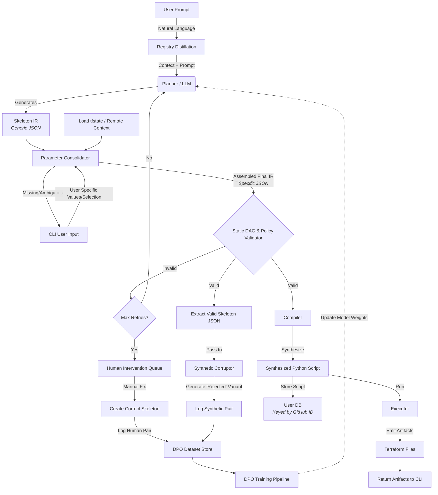

# AGX Development Status - Paused for Uni Exams
## Architecture

## Current Context
- **Goal:** Implement "Replanning" (taking existing IR + new prompt -> new IR).
- **Current State:** Basic compiler works. Validation works.
- **Next Immediate Task:** Need to implement dependency resolution for the replanner.

## The "Replanning" Logic (Don't Forget!)
1.  System needs to read the existing JSON plan (IR).
2.  LLM needs to see:
    - The User's new prompt.
    - The *current* state (the old IR).
3.  The output must be a *new* complete IR that replaces the old one.
4.  **Critical:** The compiler must overwrite `agx_resources.tf` completely.

## Outstanding Questions
- How do we handle state drift? (For now: assume IR is source of truth).
- Where does `inspect.getsource` need to be updated if we add new registry functions?

# AGX: From Prompt → JSON Plan → Validated → Terraform HCL

AGX is a verifiable AI workflow engine. You type a natural‑language instruction, AGX generates a strict JSON plan using a registry of approved functions, validates the plan, and compiles the result to Terraform HCL you can inspect locally.

Live demo: https://agx.run

## What this repo demonstrates

- Prompt → JSON plan (AWS‑first demo)
- Plan validator: ensures only registry functions, correct keys, and valid variable references
- Compiler/runtime: turns the plan into Terraform HCL and writes `main.tf`

## Quickstart

Run the AWS S3 example end‑to‑end locally:

```bash
python -m venv venv
source venv/bin/activate
pip install -r requirements.txt
python agx/registries/devops_test.py
```

This creates a `main.tf` in the repository root containing an `aws_s3_bucket` and an accompanying `aws_s3_bucket_public_access_block`.

## Example prompt and expected plan

Prompt:

Create an S3 bucket agx-demo-123 with all public access blocked and save to main.tf.

Expected planner output (JSON array only):

[
  {
    "function": "set_bucket_name",
    "args": { "name": "agx-demo-123" },
    "assign": "bucket_name"
  },
  {
    "function": "create_aws_s3_bucket",
    "args": { "bucket_name": "{bucket_name}" },
    "assign": "bucket_hcl"
  },
  {
    "function": "aws_s3_bucket_public_access_block",
    "args": { "bucket_name": "{bucket_name}", "block_all_public": true },
    "assign": "block_hcl"
  },
  {
    "function": "save_hcl_to_file",
    "args": { "hcl_content": "{bucket_hcl}\n{block_hcl}", "filename": "main.tf" }
  }
]

## Safety

- Registry‑only execution; no freeform shell
- Strict JSON: only `function`, `args`, and optional `assign`
- Variable references must be previously assigned (e.g., `"{bucket_name}"`)
- HCL is written to a local file for inspection (`main.tf`)

## Roadmap

- Today: S3 bucket + public access block + save to file
- Next: VPC, IAM, RDS primitives
- Then: CI/CD flows (GitHub Actions) and Kubernetes

## Frontend

The Next.js app in `agx_frontend/` shows the 3‑step pipeline visually. The copy and examples are AWS‑first in this branch.

---

AGX is built for verifiable DevOps automation. See the live demo at https://agx.run
